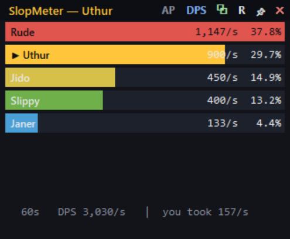

# SlopMeter

A lightweight, real-time **DPS / HPS / tanking meter for EverQuest** (live, *Legends*, and
emulated servers). It tails the game's combat log and shows a compact, always-on-top overlay
you can float over the game — plus a plain console mode.



> **Windows only. Two ways to run it:**
> - 🟢 **Download the app** — grab `SlopMeter.exe` from the [**Releases**](https://github.com/jacob760/slopmeter/releases) page and double-click. Standalone, **no Python required.**
> - 🐍 **Run from source** — needs [Python 3.8+](https://www.python.org/downloads/) (standard library only, no packages).

> 🃏 **Made for fun in ~2 prompts. Completely unsupported.**
> No issues, no PRs, no roadmap, no guarantees — if it breaks, you keep both pieces.
> It's public domain; fork it, gut it, ship your own. I'm not maintaining this.

> EverQuest has no in-client addon runtime, so — like ACT and GamParse — SlopMeter reads the
> combat log the client already writes. Nothing is injected into the game.

---

## Features

- **Live overlay** — draggable, translucent, always-on-top; ranked damage bars that update ~4×/sec
- **Three views** — **DPS** (damage done), **HPS** (healing done), and your **DTPS** (damage taken, for tanking)
- **Smart attribution** — your melee, spells and DoTs, groupmates, and pets; mobs are kept out of the damage table automatically
- **Pet nesting** — map a pet to its owner and its damage folds into the owner's total, shown as an indented child row
- **Encounter tracking** — auto-resets after a lull so each pull is its own parse
- **Copy parse** — one click puts a chat-ready one-liner on your clipboard to paste into `/g`, `/gu`, `/say`
- **In-game auto-post** *(optional, off by default)* — a hotbutton triggers SlopMeter to post the parse to group for you
- **Zero setup** — auto-detects your EverQuest `Logs` folder (Daybreak launcher, Steam, or legacy installs), or pick it once and it's remembered

---

## Requirements

- **Windows** (uses the Windows clipboard / window APIs)
- **Python 3.8+** — [python.org/downloads](https://www.python.org/downloads/) (check *"Add Python to PATH"*)
- No third-party packages.

---

## Quick start — the easy way (no Python)

1. Download **`SlopMeter.exe`** from the [**Releases**](https://github.com/jacob760/slopmeter/releases) page. Put it anywhere.
2. In EverQuest, log in and type `/log on` (once per character).
3. Double-click **`SlopMeter.exe`**. It auto-finds your Logs folder (or asks you to pick it once, then remembers).
4. Go fight something. Drag the top bar to move it over the game.

> First launch may show Windows SmartScreen ("Windows protected your PC") because the app is
> unsigned. Click **More info ▸ Run anyway**. (It's a tiny open-source log reader — the
> [source is right here](https://github.com/jacob760/slopmeter) if you want to check or build it yourself.)

## Quick start — from source (needs Python)

1. **Install Python:** [python.org/downloads](https://www.python.org/downloads/) — tick **"Add Python to PATH"**.
2. **Get SlopMeter:** **Code ▸ Download ZIP**, unzip anywhere.
3. In EverQuest: `/log on`.
4. Double-click **`SlopMeter.bat`** (overlay) or **`SlopMeter-console.bat`** (console).

*(Overlay always-on-top works with EQ in **windowed** or **borderless** mode. True exclusive
fullscreen can cover any overlay — switch EQ to borderless if it hides.)*

---

## Overlay controls

| Control | Action |
|--------|--------|
| **drag top bar** | move the window |
| **right-click title** | change / re-pick your EQ folder |
| **DPS ⇄ HPS** | toggle which table is shown (DTPS stays in the footer) |
| **⧉** | copy the current parse to the clipboard |
| **R** | reset the current encounter |
| **AP** | arm in-game auto-post (green = on) |
| **📌** | toggle always-on-top |
| **✕** | close |

---

## Copy / share a parse

Click **⧉** to drop a single line like this on your clipboard, then paste into chat:

```
DPS 62s vs a loathling lich | 1) Rude 1,161 (38%)  2) Uthur 909 (30%)  3) Jido 463 (18%) | raid 20,576/s
```

It's intentionally one line, because EQ's chat input is a single line — paste-and-send in one go.

### Optional: in-game auto-post

Prefer to trigger it from inside the game? Arm **AP** and make an EQ social/hotbutton:

```
/say #dps
```

When you press it, SlopMeter sees `#dps` in the log and posts the parse to group (`/g …`).
Triggers: **`#dps`**, **`#hps`**, **`#parse`** (whatever's on screen). Change the destination
channel via `CHANNEL` at the top of `eqdps_ui.py` (e.g. `"/gu "` for guild).

> ⚠️ **Auto-post uses synthetic keystrokes (clipboard + Ctrl+V).** That's input automation, which
> some emulated servers' rules forbid. It is **off by default** and only fires while EQ is the
> active window. Use it at your own discretion — when in doubt, use the **⧉** copy button and
> paste manually.

---

## Pets

EverQuest never names a pet's owner on its damage lines, so pets show up as their own
combatant by default. To fold a pet into its owner — displayed as an indented child row,
with the owner's total including the pet — give SlopMeter a mapping:

- Create a **`pets.txt`** next to the scripts (see `pets.txt.example`) with one line per pet:
  ```
  Gybez = Rude
  Vexer = Slippy
  ```
- Or let it **auto-learn**: any `My leader is <owner>` line SlopMeter sees (e.g. target a
  groupmate's pet and have them `/pet leader`) is added to `pets.txt` for you.

```
▶ Rude            1,147/s  37.8%
   └ Gybez          320/s
  Uthur              900/s  29.7%
```

## How it finds your logs

Resolution order: an explicit `--logs` path → a remembered choice
(`%LOCALAPPDATA%\slopmeter\config.json`) → auto-detection (a running `eqgame.exe`, the Daybreak
launcher's `Public\...\Installed Games`, Steam libraries, and legacy Sony/common installs).
Whatever it finds is saved so the next launch is instant.

Console flags:
```
python eqdps.py --logs "C:\path\to\EverQuest\Logs"   # override
python eqdps.py "C:\path\to\eqlog_Name_server.txt"    # a specific log
python eqdps.py --idle 12                              # encounter reset gap (seconds)
```

---

## Files

| File | Purpose |
|------|---------|
| `eqdps_ui.py` | the overlay UI (flagship) |
| `eqdps.py` | the console meter + the shared log parser/attribution |
| `eqchat.py` | posts a parse into EQ chat (clipboard + Ctrl+V) |
| `eqfind.py` | auto-detects and remembers the EQ Logs folder |
| `pets.txt.example` | template for mapping pets to owners |
| `SlopMeter.bat` / `SlopMeter-console.bat` | launchers |

---

## Known limitations

- Some direct nukes are logged by EQ as *"hit by non-melee"* with **no caster name** — those can't
  be attributed to anyone. Named melee, spells, DoTs, and heals are all covered.
- Player-vs-mob attribution assumes standard EQ naming (player names are single words; mobs have
  articles/spaces). Unusual named allies may be miscategorized.

---

## Disclaimer

A throwaway fun project — **not maintained, not supported.** Not affiliated with Daybreak Game
Company or any EverQuest server; just a fan-made log reader. Respect your server's rules,
especially before enabling auto-post. Provided as-is, zero warranty, use at your own risk.

## License

**The Unlicense** — public domain. Do whatever you want; no attribution needed, no strings.
It's not "really" licensed, on purpose. See [LICENSE](LICENSE).
